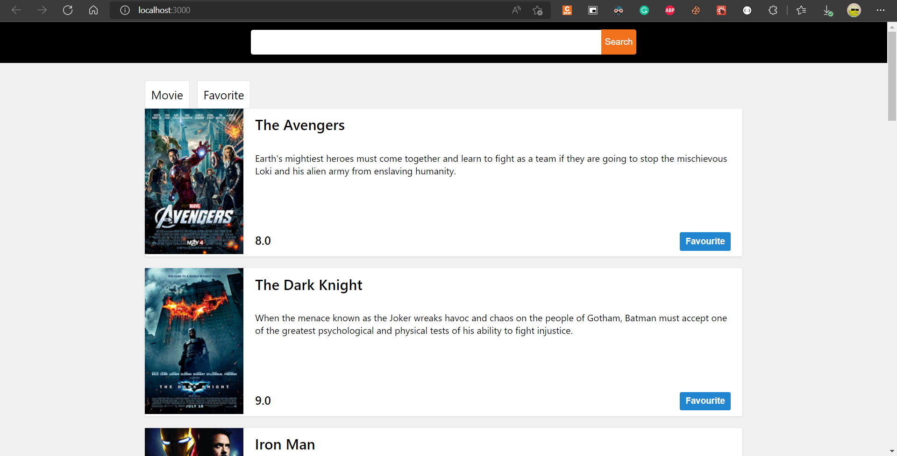

In this project we can search any movie using OMDB API and add it to movie list, after adding to movie list, we can add that move to favourite list and we can Un favourite it.
### Folder Structure
```
movie-app
├─ .git
├─ .gitignore
├─ package-lock.json
├─ package.json
├─ public
│  ├─ favicon.ico
│  ├─ index.html
│  ├─ logo192.png
│  ├─ logo512.png
│  ├─ manifest.json
│  └─ robots.txt
├─ README.md
└─ src
   ├─ actions
   │  └─ index.js
   ├─ components
   │  ├─ App.js
   │  ├─ MovieCard.js
   │  └─ Navbar.js
   ├─ data.js
   ├─ index.css
   ├─ index.js
   └─ reducers
      └─ index.js

```
## Project Screenshots




